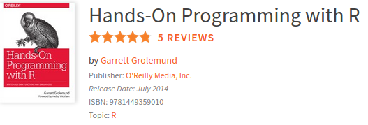

## PlayingCards
Code originally from the book Hands-On Programming with R by Garrett Grolemund
An excellent source of simple procedures to use R amazing mechanisms to write robust simulation code.

In this particular example environments are used to create bullet proof closures around a deck of playing 
cards and the functions that work with it.

In particular the deck creation is done once by loading the data from the book Github site, then passed on to the
function that sets up the functions that work on the deck.
R's amazing environments mechanism allows the _setup_ function to seal off in its environment a copy of the original 
deck, to be used by shuffle.

The function deal, on the other hand, maintains the state of the current deck in the environment of setup because
it is a property of every R function to retain the environment in which they ere created. This deck gets smaller by
one card after dealing it, the top-most card by default.

